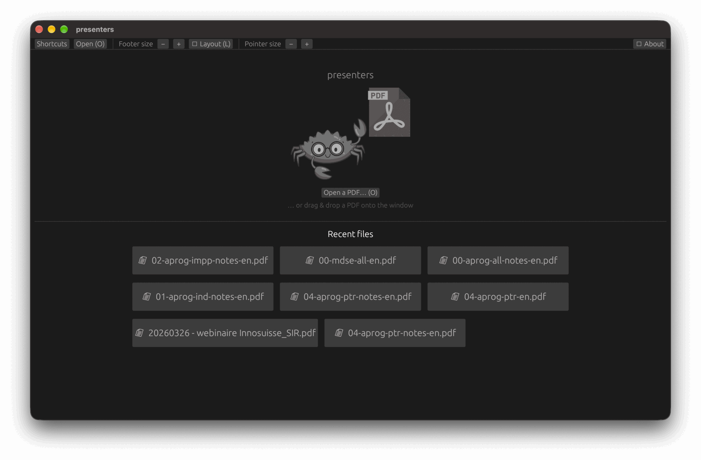
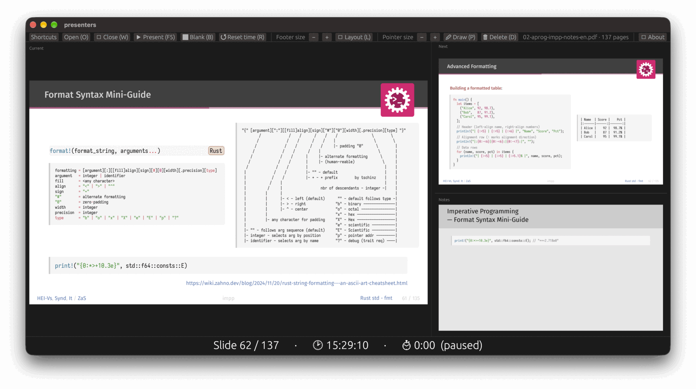
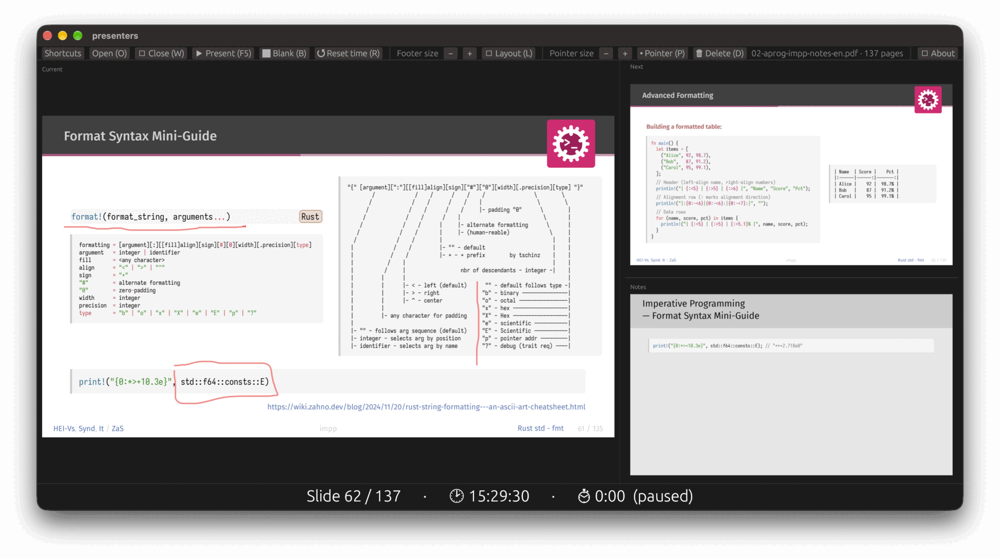

<div align="center">


# presenters

**A fast, native dual-screen PDF presenter for Typst & LaTeX slides - inspired by [pympress](https://github.com/Cimbali/pympress).**

Runs on macOS · Windows · Linux · Built with [egui](https://github.com/emilk/egui) + [PDFium](https://pdfium.googlesource.com/pdfium/)

</div>

---

## What it does

Open a PDF exported from **Typst** or **LaTeX/Beamer** and drive a talk with two windows:

- 🖥️ **Presenter window** - the current slide, a next-slide preview, your speaker notes, and a talk timer.
- 📽️ **Audience window** - just the slide, on black, fullscreen on the projector.

It stays instant even on large decks (300+ pages) thanks to lazy rendering, a texture cache, and next-slide prefetch.

## Screenshots

**Start screen** - launch with no file to pick from your recent decks, or just drag & drop a PDF onto the window.



**Presenter window** - the current slide, a next-slide preview, the current slide's speaker notes, and a centered slide counter, wall clock, and talk timer.



**Live annotation** - hold the mouse over the current slide to draw freehand (mirrored on the audience screen); press `P` to switch between the laser pointer and drawing, and `D` to clear.




## Features

- **Works with or without notes.** Auto-detects Beamer/Typst "notes on second screen" decks (a double-width page whose right half is the notes) and splits the slide from the notes. Plain decks just work too.
- **Two windows, second-screen aware.** Start the audience window with `F5`, quit it with `Esc` - the presenter window keeps running. If a **second screen** is attached, the audience window is placed on it and fullscreened automatically (presenter stays on the primary); on a single screen it opens windowed. Double-click the audience window to toggle fullscreen.
- **Adaptive, resizable layout.** With notes, cycle 4 arrangements of current / next / notes; without notes, toggle a horizontal or vertical current + next split. Drag any divider to resize; sizes are remembered.
- **Talk timer + clock.** The footer shows the slide number, the current wall-clock time (with seconds), and a talk stopwatch that runs while you present, pauses when you quit the presentation, and resets with `R` - large and centered.
- **Adjustable footer size.** Make the slide counter and timer as big as you want.
- **Recent files + resume.** Launch with no file to pick from a recent-files list; reopening a deck resumes at the page you left off.
- **Remembers everything.** Window position, panel sizes, footer font, chosen layout, and recent files persist between sessions.
- **Fast on big decks.** Lazy, cached, prefetched rendering - no waiting on 300-page PDFs.

Settings live in a single JSON file in a per-OS config directory named `presenter`:
`~/.config/presenter/state.json` on macOS & Linux (honoring `$XDG_CONFIG_HOME`), and
`%APPDATA%\presenter\state.json` on Windows.

## Prerequisites: the PDFium library

Rendering uses Google's PDFium via [`pdfium-render`](https://crates.io/crates/pdfium-render), which loads the PDFium dynamic library at runtime. Fetch the prebuilt library for your platform (the app looks next to the binary, in a `lib/` subfolder, then in `third_party/pdfium/lib/`):

```bash
just setup-pdfium
```

This downloads the matching build from [bblanchon/pdfium-binaries](https://github.com/bblanchon/pdfium-binaries) for your OS/arch into `third_party/pdfium/` (git-ignored).

The app finds the library next to the binary, under an installed prefix (`.deb`/`.app` bundles
include it), in `third_party/pdfium/lib/` relative to the working directory, or via the
`PDFIUM_LIB_DIR` environment variable. On Linux, if you run an installed binary outside the
repo, install the library system-wide instead:

```bash
sudo install -m0644 third_party/pdfium/lib/libpdfium.so /usr/local/lib/ && sudo ldconfig
```

## Build & run

```bash
just run                 # open the example deck (no notes)
just run-notes           # open the example deck (with speaker notes)
just run file=deck.pdf   # open your own PDF
just run-empty           # start with no file - shows the recent-files screen
```

Or without `just`:

```bash
cargo run --release -- examples/04-aprog-ptr-en.pdf
```

Launch with no argument and press **O** (or click **Open**) to pick a file.

## Keyboard & mouse shortcuts

| Input | Action |
| --- | --- |
| `→` / `Space` / `PageDown` / scroll down | Next slide |
| `←` / `PageUp` / scroll up | Previous slide |
| `Home` / `End` | First / last slide |
| `F5` | Start presentation (audience window) |
| `Esc` | Quit presentation |
| `B` | Blank the audience screen (black) |
| `W` | Close the file, back to the start screen |
| `R` | Reset the talk timer |
| `L` | Flip layout (H/V with no notes; 4 presets with notes) |
| `+` / `−` | Footer font larger / smaller |
| `O` | Open a PDF |
| `P` | Toggle laser pointer / drawing |
| `D` | Delete all drawings |
| Hold mouse on current slide (either window) | Laser pointer / draw (shown on the audience screen) |
| `Ctrl` (or `⌘`) + scroll (either window) | Zoom the current slide at the cursor |
| `Ctrl` (or `⌘`) + drag (either window) | Pan the zoomed slide |
| Double-click (audience) | Toggle fullscreen |
| Drag & drop a PDF | Open it |

All mouse features work on **either window** - the presenter window's current slide *and* the
audience Presentation window - and both drive the same shared state, so pointer, drawings, and
zoom always mirror between them. Use whichever window your cursor is on (handy when you stand
by the projected screen).

**Laser pointer & drawing:** hold the mouse button over the **current slide** (in either
window) and a semi-transparent dot appears at that spot on the audience screen, following your
cursor; release to hide. Press **`P`** (or the header button) to toggle **drawing** mode, where
holding and dragging draws freehand lines on the slide instead; **`D`** deletes all drawings.
The **Pointer size −/+** buttons in the header set both the dot size and the line thickness.
Drawings are kept per slide while you navigate, and cleared when you close the file (never
saved to disk).

**Scroll & zoom:** the scroll wheel navigates slides in either window; hold **Ctrl** (or ⌘) and
**scroll** to zoom the current slide in/out at the cursor, and **Ctrl + drag** to pan around -
mirrored on both screens so you can show a detail to the room. Zoom resets when you change
slides.

You can also **drag & drop a PDF onto the window** to open it. The **Shortcuts** button in
the header shows the key list in-app.

## Packaging

Build a native, self-contained bundle (icon + PDFium included) with
[cargo-bundle](https://github.com/burtonageo/cargo-bundle):

```bash
cargo install cargo-bundle   # once (also part of `just install`)
just bundle                  # bundle for the current OS (release)
```

Per-format recipes (run each **on its target OS** - cargo-bundle does not cross-build):

| Recipe | Output | Platform |
| --- | --- | --- |
| `just bundle-mac` | `Rust Presenters.app` | macOS |
| `just bundle-deb` | `.deb` | Linux (Debian/Ubuntu) |
| `just bundle-appimage` | `.AppImage` | Linux |
| `just bundle-msi` | `.msi` | Windows |

Bundles land under `target/release/bundle/<format>/`. The recipes run `ensure-pdfium`
first, so the matching PDFium library is downloaded and shipped inside the bundle; at
runtime the app finds it there (e.g. macOS `Contents/Resources/`) with no external setup.

**macOS signing.** cargo-bundle adds files after the binary is signed, which invalidates
the signature and makes macOS report the app as "damaged". `just bundle-mac` therefore
**ad-hoc signs** the finished bundle so it runs locally. An app *downloaded* from elsewhere
is also quarantined - open it the first time via right-click → **Open**, or clear the flag
with `xattr -dr com.apple.quarantine <app>`. Distributing without any warning requires a
Developer ID signature and notarization (an Apple Developer account).

## Development

```bash
just            # list all recipes
just test       # run tests
just clippy     # lint
just build      # release build into bin/
```

Tests are headless and need the PDFium library present (run `just setup-pdfium` first).

The **About** window (button at the far right of the header) shows the app info and the
third-party libraries with their licenses. That list is generated from the dependency tree
with [cargo-about](https://github.com/EmbarkStudios/cargo-about) and embedded into the app;
regenerate it after changing dependencies:

```bash
just thirdparty   # writes assets/thirdparty.md (needs: cargo install cargo-about --features cli)
```

## License

Licensed under the MIT license ([LICENSE](LICENSE)).

PDF rendering uses Google's PDFium (BSD-3-Clause), bundled with the application. The full
license texts for PDFium and every Rust dependency are shown in the app's **About** window
and generated into `assets/thirdparty.md` (`just thirdparty`).
