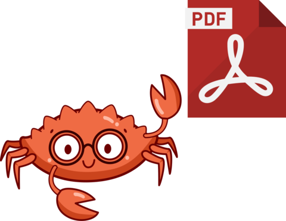
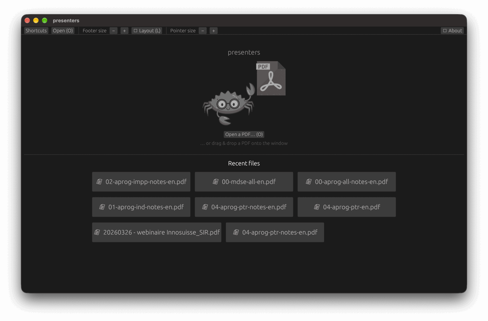
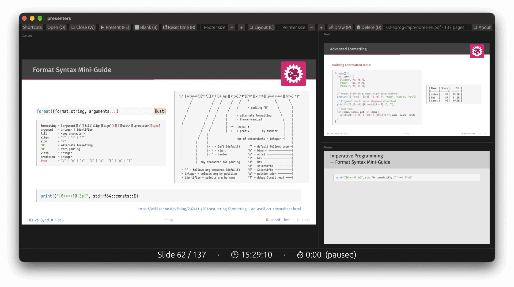
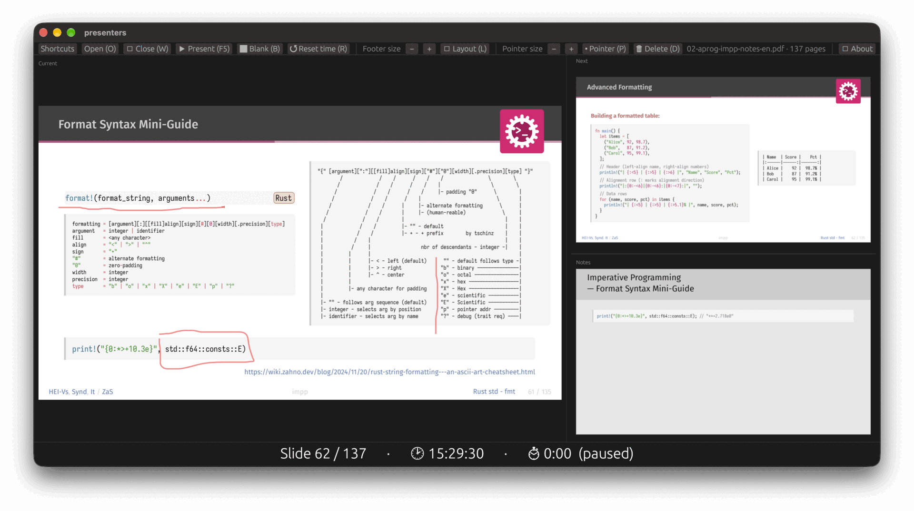

<div align="center">



# presenters

**A fast, native dual-screen PDF presenter for Typst & LaTeX slides.**

Runs on macOS · Windows · Linux · Built with [egui](https://github.com/emilk/egui) + [PDFium](https://pdfium.googlesource.com/pdfium/)

[](https://github.com/tschinz/presenters/stargazers) [](https://github.com/tschinz/presenters/releases/latest) [](https://github.com/sponsors/tschinz)

</div>

---

## What it does

Open a PDF exported from **Typst** or **LaTeX/Beamer** and drive a talk with two windows:

- 🖥️ **Presenter window** - the current slide, a next-slide preview, your speaker notes, a talk timer, and a thumbnail strip of all slides.
- 📽️ **Audience window** - just the slide, on black, fullscreen on the projector.

It stays instant even on large decks (300+ pages) thanks to lazy rendering, a texture cache, and next-slide prefetch.

## Screenshots

**Start screen** - launch with no file to pick from your recent decks, or just drag & drop a PDF onto the window.



**Presenter window** - current slide, next-slide preview, speaker notes, a centered slide counter / clock / timer, and the slide thumbnail strip.



**Live annotation** - hold the mouse over the current slide to draw freehand (mirrored on the audience screen); press `P` to switch between the laser pointer and drawing, and `D` to clear.



## Install

Grab a prebuilt binary from the [latest release](https://github.com/tschinz/presenters/releases/latest) — PDFium is bundled, so there is nothing else to install:

| Platform | Asset | Notes |
| --- | --- | --- |
| macOS (Apple Silicon) | `presenters-macos-arm64.zip` | ad-hoc-signed `.app`; open via right-click → **Open** the first time |
| Linux (Debian/Ubuntu) | `rust-presenters_<ver>_amd64.deb` | `sudo dpkg -i` the file |
| Windows (x64) | `presenters-windows-x64.zip` | portable (`presenters.exe` + `pdfium.dll`) |

Intel Macs and other Linux distros are not prebuilt — [build from source](#build-from-source).

### One-line install

**macOS & Linux** — installs the `.app` into `/Applications` (clearing quarantine) or the `.deb` via `dpkg`:

```bash
curl -fsSL https://raw.githubusercontent.com/tschinz/presenters/main/install.sh | bash
```

**Windows** (PowerShell) — extracts the portable build to `%LOCALAPPDATA%\Programs\presenters` and adds a Start Menu shortcut:

```powershell
irm https://raw.githubusercontent.com/tschinz/presenters/main/install.ps1 | iex
```

## Features

- **Works with or without notes.** Auto-detects Beamer/Typst "notes on second screen" decks (a double-width page whose right half is the notes) and splits them; plain decks just work.
- **Two windows, second-screen aware.** `F5` opens the audience window — on a second screen it goes fullscreen there automatically; on a single screen it goes fullscreen over the presenter (all shortcuts still work). `Esc` quits it while the presenter keeps running.
- **Thumbnail strip.** A scrollable, resizable filmstrip of every slide; click to jump, and it follows the current slide. Toggle with `T`.
- **Adaptive, resizable layout.** Cycle 4 current/next/notes arrangements (or a H/V current+next split without notes) with `L`; drag any divider to resize. Sizes are remembered.
- **Laser pointer & drawing, mirrored.** Hold the mouse on the current slide for a pointer dot, or press `P` to draw freehand — shown live on the audience screen. Pick the colour from a swatch in the header.
- **Zoom & pan.** `Ctrl`/`⌘` + scroll zooms at the cursor, `Ctrl` + drag pans — on either window, mirrored to the room.
- **Talk timer + clock, light/dark theme.** Large centered footer with slide number, wall clock, and a stopwatch that follows the presentation; cycle system/dark/light theme from the header.
- **Recent files + resume.** Launch with no file to pick a recent deck; reopening resumes at the page you left off.
- **Remembers everything.** Window position, panel sizes, fonts, layout, theme, pointer colour, thumbnail strip, and recent files persist between sessions, in a single JSON file (`~/.config/presenter/state.json` on macOS/Linux, `%APPDATA%\presenter\state.json` on Windows).

## Keyboard & mouse shortcuts

| Input | Action |
| --- | --- |
| `→` / `Space` / `PageDown` / scroll down | Next slide |
| `←` / `PageUp` / scroll up | Previous slide |
| `Home` / `End` | First / last slide |
| `F5` / `Esc` | Start / quit presentation |
| `B` | Blank the audience screen (black) |
| `W` | Close the file, back to the start screen |
| `R` | Reset the talk timer |
| `L` | Flip layout |
| `T` | Toggle the thumbnail strip |
| `S` | Swap presenter / presentation screens |
| `+` / `−` | Footer font larger / smaller |
| `O` | Open a PDF |
| `P` / `D` | Toggle laser pointer / drawing · delete all drawings |
| Hold mouse on current slide (either window) | Laser pointer / draw (shown on the audience screen) |
| `Ctrl` (or `⌘`) + scroll / drag (either window) | Zoom at the cursor / pan the zoomed slide |
| Double-click (audience) | Toggle fullscreen |
| Drag & drop a PDF | Open it |

All mouse features work on **either window** and drive the same shared state, so the pointer, drawings, and zoom always mirror between the presenter and audience screens. The **Shortcuts** button in the header shows this list in-app.

## Build from source

Rendering needs Google's PDFium (loaded at runtime). Fetch the prebuilt library for your platform once, then run:

```bash
just setup-pdfium        # downloads PDFium into third_party/pdfium/ (git-ignored)
just run                 # open the example deck (no notes)
just run-notes           # open the example deck (with speaker notes)
just run file=deck.pdf   # open your own PDF
```

Without `just`: `cargo run --release -- examples/04-aprog-ptr-en.pdf` (PDFium must be reachable — next to the binary, in `third_party/pdfium/lib/`, or via `$PDFIUM_LIB_DIR`).

## Packaging

Releases are built by CI on a `v*` tag: a macOS `.app` (zipped, ad-hoc signed), a Linux `.deb`, and a Windows portable zip. To build a self-contained bundle yourself (icon + PDFium included) with [cargo-bundle](https://github.com/burtonageo/cargo-bundle):

```bash
just bundle        # bundle for the current OS
```

Per-format recipes (run each **on its target OS** — cargo-bundle does not cross-build): `just bundle-mac` (`.app`), `just bundle-deb` (`.deb`), `just bundle-appimage` (`.AppImage`, Linux-only, not shipped in releases), `just bundle-msi` (`.msi`, Windows, needs WiX). `just bundle-mac` ad-hoc signs the `.app` so it isn't reported as "damaged" locally.

## Development

```bash
just            # list all recipes
just test       # run tests (headless; need PDFium present)
just clippy     # lint
just build      # release build into bin/
```

The **About** window lists every third-party library with its license, generated from the dependency tree with [cargo-about](https://github.com/EmbarkStudios/cargo-about) and embedded into the app; regenerate with `just thirdparty` after changing dependencies.

## License

Licensed under the [MIT license](LICENSE). PDF rendering uses Google's PDFium (BSD-3-Clause), bundled with the application; full license texts are in the app's **About** window and in `assets/thirdparty.md`.
